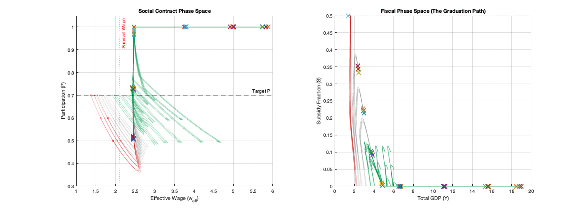

# Minimal Decoupling Model (MDM)

**A dynamical systems model exploring control-theoretic policies to steer automation-impacted economies toward high-prosperity stability points.**


Principal Investigator: Richard Moore, AI Collaborators: Gemini 3, ChatGPT-5.1


[](https://opensource.org/licenses/MIT)
[](https://www.mathworks.com/products/matlab.html)

This project was developed through a dialectic process between the human author and two Large Language Models. The mathematical conceptualization, code generation, and debugging were a joint effort.

---

## Overview


*Figure 1: Visualization of stability basins in the Minimal Decoupling Model, demonstrating that automation-impacted economies may settle into distinct equilibria with varying levels of prosperity.*

The **Minimal Decoupling Model (MDM)** is a parsimonious set of differential algebraic equations (DAE) designed to investigate the macroeconomic dynamics of rapid technological automation. 

Unlike traditional equilibrium models, the MDM treats the economy as a dynamical system where widespread automation of cognitive and physical labor can decouple GDP growth from median wage growth. The project focuses on:

1.  **Non-Linear Dynamics:** Identifying how efficiency shocks can push an economy between different basins of attraction.
2.  **Control Theory:** Assessing regulatory mechanisms (such as wage subsidies, UBI, or robot taxes) as "steering" inputs to guide the system toward high-prosperity equilibria.
3.  **Bifurcation Analysis:** Understanding the critical thresholds where economic stability might break down or shift.

## Repository Contents

* `/code`: The primary MATLAB simulation scripts (`.m`).
* `/docs`: Mathematical formulation, LaTeX presentation of the constituent models, and the project abstract.
* `/output`: Informative output sets, phase portraits, and time-series plots generated by the model.

## Getting Started

### Prerequisites
* **MATLAB R2024b** (or newer).
* No additional toolboxes are strictly required for the base simulation, though the `Symbolic Math Toolbox` may be useful for verifying DAE consistency.

### Running the Simulation
1.  Clone this repository:
    ```bash
    git clone [https://github.com/YourUsername/MinimalDecouplingModel.git](https://github.com/YourUsername/MinimalDecouplingModel.git)
    ```
2.  Navigate to the `/code` directory in MATLAB.
3.  Open `MDM_simulation_main.m` (or your specific filename).
4.  Run the script. The model will integrate the system over the specified time horizon and generate figures for Labor Participation, GDP vs. Wages, and Phase Space trajectories.

## The Model

The MDM integrates standard production functions with a dynamic labor supply response and a technology-driven efficiency parameter.

* **State Variables:** Capital ($K$), Labor ($L$), Wages ($w$), Technology/Efficiency ($A$).
* **Dynamics:** The system evolves according to differential equations governing capital accumulation and technological diffusion, constrained by algebraic equations representing market clearing conditions.

*(See `/docs/model_formulation.pdf` for the full mathematical derivation.)*

## Citation & Attribution

If you use this model, code, or the associated stability analysis in your research or project, please cite this repository:

> [Richard Moore]. (2025). *Minimal Decoupling Model (MDM): A dynamical systems approach to automation economics*. GitHub. https://github.com/thecowgoesmoo/MinimalDecouplingModel

## License

This project is licensed under the MIT License - see the [LICENSE](LICENSE) file for details.
