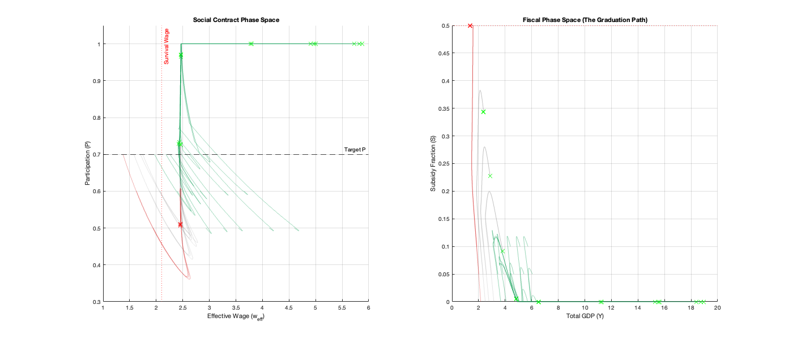

# The Minimal Decoupling Model (MDM)
### Closed-Loop Control of Labor Participation in High-Automation Economies

> **"A rising tide lifts all boats, but a tsunami requires a steered course.**
> **It is time to navigate, not just float."**

## Overview
The **Minimal Decoupling Model (MDM)** is a dynamical systems simulation that applies **Control Theory** to macroeconomic policy.

As automation technologies (AI, Robotics) advance, capital becomes increasingly substitutable for labor ($\sigma > 1$). Standard economic models often assume this displacement is transient. The MDM demonstrates that under specific high-friction, high-substitution regimes, an economy can enter a **"Participation Trap"**: a stable equilibrium where GDP soars, but labor force participation collapses to near zero.

This repository provides a rigorous mathematical framework to test regulatory interventions. It demonstrates that open-loop policies (like UBI) often fail to stabilize the system, whereas a **Closed-Loop PI Controller** (targeting participation rates via dynamic wage subsidies) can successfully bridge the transition to a high-automation future.

### The Landscape (Phase Space)

*Figure 1: Basin of Attraction analysis. The **Teal trajectories** represent the "Safe Zone" where the Thermostat Controller successfully stabilizes participation ($P \to 0.7$). The **Red trajectories** show the "Subsidy Trap," where the economy collapses despite intervention because it started with insufficient capital or participation.*

### The Solution (Time Series)

*Figure 2: A single simulation run of the "Thermostat Economy." Note how the **Subsidy (Top Right)** rises to bridge the wage gap, then naturally declines as capital accumulation eventually raises the market wage above the survival threshold.*

## The Problem: Structural Decoupling
In a standard Solow growth model, labor and capital are complements. More robots mean higher marginal productivity for humans, and thus higher wages.

However, when the elasticity of substitution $\sigma > 1$ (as is likely with Generative AI), capital can replace labor. The MDM models this dynamic using:
1.  **Hysteretic Labor Supply:** Participation ($P$) is a state variable driven by the gap between the *Effective Wage* and a *Reservation Wage*. It has "memory"—once people leave the workforce, it is hard to get them back.
2.  **Investment Friction:** Capital cannot scale infinitely fast. We model adjustment costs ($\phi$) to simulate real-world supply chain and integration bottlenecks.

## The Solution: The Thermostat Economy
Instead of static redistribution, we propose a **Control Theoretic** approach:
* **Sensor:** Measure Labor Force Participation Rate ($P$).
* **Actuator:** A Variable Wage Subsidy ($S$) funded by a tax on automation surplus.
* **Controller:** A Proportional-Integral (PI) Controller that adjusts $S$ to minimize the error between $P$ and a target (e.g., 0.70).

This creates a "Thermostat" that heats up the labor market when it cools, and turns itself off once capital accumulation raises the natural market wage above the survival threshold.

## Repository Structure

* **`MDM_Demo.m`**: **Run this first.** A single-shot simulation of the "Thermostat" strategy. It visualizes the time-series evolution of GDP, Wages, and the Subsidy Bridge over 50 years.
* **`MDM_PhaseSpace_Analysis.m`**: A rigorous stress-test that simulates the economy across a grid of initial conditions. It generates the Phase Portrait (Basin of Attraction) to determine robustness.

## Mathematical Formulation
The system is defined by a set of coupled Differential Algebraic Equations (DAEs).

**Production (High-Tech Sector):**
$$Y_H = A_H K_H^\alpha \left[ (1-\mu)L_H^\rho + \mu (\psi(\theta) R)^\rho \right]^{\frac{1}{\rho}}$$

**Labor Participation Dynamics:**
$$\dot{P} = \eta P \tanh(\lambda (w_{\text{eff}} - w_{\text{bar}})) - \chi (\text{Exclusion})$$

**Closed-Loop Control Law:**
$$S(t) = \text{sat}_{[0, S_{\text{max}}]} \left( K_p e(t) + K_i \int_{0}^{t} e(\tau) d\tau \right)$$

*See source code for full parameter definitions and implementation details.*

## Getting Started
1.  Clone the repository.
2.  Open MATLAB (R2023b or later recommended).
3.  Run `MDM_Demo.m`.

## Authors
* **Richard Moore**
* **Gemini 3** (Technical Co-Pilot)
* **ChatGPT-5** (Conceptual Co-Pilot)

## Citation & Attribution

This project was developed through a dialectic process between the human author and two Large Language Models. The mathematical conceptualization, code generation, and debugging were a joint effort.

If you use this model, code, or the associated stability analysis in your research or project, please cite this repository:

> [Richard Moore]. (2025). *Minimal Decoupling Model (MDM): A dynamical systems approach to automation economics*. GitHub. https://github.com/thecowgoesmoo/MinimalDecouplingModel

## License
MIT License
